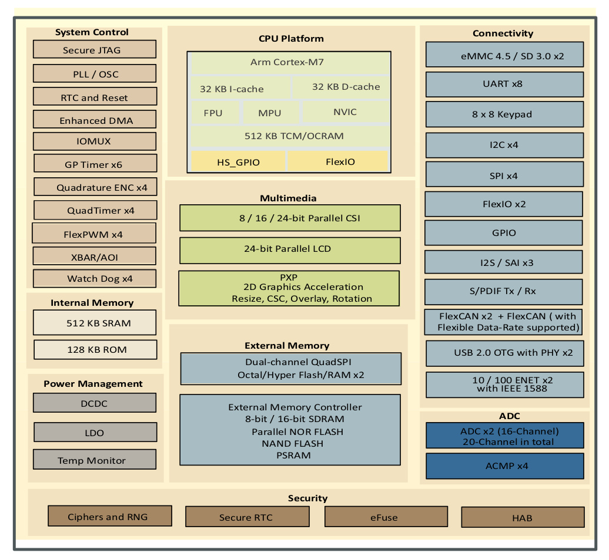

.. _mimxrt_general:

General information about the MIMXRT port
=========================================

The i.MXRT MCU family is a high performance family of devices made by
NXP. Based on a ARM7 core the provide may on-chip I/O units for building
small to medium sized devices.

Multitude of boards
-------------------

There is a multitude of modules and boards from different sources which carry
a i.MXRT chip. MicroPython tries to provide a generic port which would run on
as many boards/modules as possible, but there may be limitations. The
NXP IMXRT1020-EVK and the Teensy 4.0 and Teensy 4.1 development boards are taken
as reference for the port (for example, testing is performed on them).
For any board you are using please make sure you have a datasheet, schematics
and other reference materials so you can look up any board-specific functions.

To make a generic MIMXRT port and support as many boards as possible the
following design and implementation decision were made:

* GPIO pin numbering is based on the board numbering as well as on the
  MCU numbering.  Please have the manual/pin diagram of your board at hand
  to find correspondence between your board pins and actual i.MXRT pins.
* All MCU pins are supported by MicroPython but not all are usable on any given board.

Technical specifications and SoC datasheets
-------------------------------------------

The datasheets and other reference material for i.MXRT chip are available
from the vendor site: https://www.nxp.com/products/processors-and-microcontrollers/arm-microcontrollers/i-mx-rt-crossover-mcus:IMX-RT-SERIES .
They are the primary reference for the chip technical specifications, capabilities,
operating modes, internal functioning, etc.

For your convenience, a few technical specifications are provided below:

* Architecture: ARM Cortex M7
* CPU frequency: up to 600MHz
* Total RAM available: up to 1 MByte (part of it reserved for system)
* BootROM: 96KB
* External FlashROM: code and data, via SPI Flash; usual size 2 - 8 MB
  Some boards provide additional external RAM and SPI flash.
* GPIO: up to 124 (GPIOs are multiplexed with other functions, including
  external FlashROM, UART, etc.)
* UART: 4 or 8 RX/TX UART. Hardware handshaking is supported by the MCU,
  but the board used for testing do not expose the signals.
* SPI: 2 or 4 low power SPI interfaces
* I2C: 2 or 4 low power I2C interfaces (bitbang implementation available on any pins)
* I2S: 3 I2S interfaces
* ADC: one or two 12-bit SAR ADC converters
* Ethernet controller
* Programming: using BootROM bootloader from USB - due to external FlashROM
  and always-available BootROM bootloader, the MIMXRT is not brickable

The lower numbers apply to the i.MXRT 101x MCU.

i.MX RT 1062 block diagram.

For more information see the i.MXRT datasheets or reference manuals.
