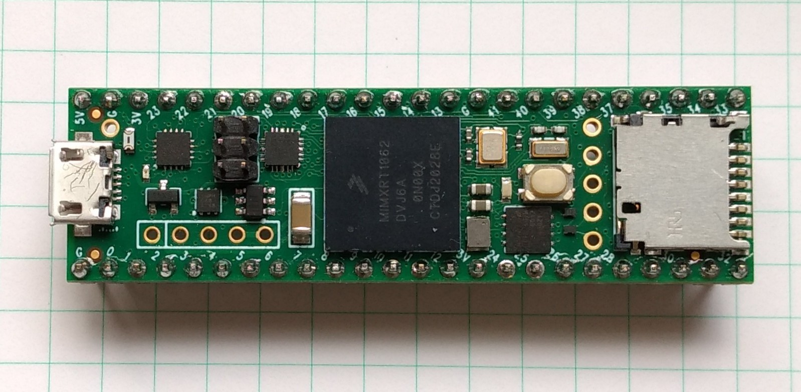

.. _mimxrt_quickref:

Quick reference for the i.MXRT family
=====================================

The Teensy 4.1 board.

Below is a quick reference for i.MXRT-based boards.  If it is your first time
working with this board it may be useful to get an overview of the microcontroller:

.. toctree::
   :maxdepth: 1

   general.rst
   tutorial/intro.rst

Installing MicroPython
----------------------

See the corresponding section of tutorial: :ref:`mimxrt_intro`. It also includes
a troubleshooting subsection.

General board control
---------------------

The MicroPython REPL is on the USB port, configured in VCP mode.
Tab-completion is useful to find out what methods an object has.
Paste mode (ctrl-E) is useful to paste a large slab of Python code into
the REPL.

The :mod:`machine` module::

    import machine

    machine.freq()          # get the current frequency of the CPU

The :mod:`mimxrt` module::

    import mimxrt

    # low level methods to interact with flash storage
    mimxrt.flash_size()
    mimxrt.flash_user_start()
    mimxrt.flash_erase(sector_no)
    mimxrt.flash_write(byte_offset, buffer)
    mimxrt.flash_read(byte_offset, buffer)

Delay and timing
----------------

Use the :mod:`time <utime>` module::

    import time

    time.sleep(1)           # sleep for 1 second
    time.sleep_ms(500)      # sleep for 500 milliseconds
    time.sleep_us(10)       # sleep for 10 microseconds
    start = time.ticks_ms() # get millisecond counter
    delta = time.ticks_diff(time.ticks_ms(), start) # compute time difference

Timers
------

The i.MXRT port has three hardware timers. Use the :ref:`machine.Timer <machine.Timer>` class
with a timer ID from 0 to 2 (inclusive)::

    from machine import Timer

    tim0 = Timer(0)
    tim0.init(period=5000, mode=Timer.ONE_SHOT, callback=lambda t:print(0))

    tim1 = Timer(1)
    tim1.init(period=2000, mode=Timer.PERIODIC, callback=lambda t:print(1), hard=True)

The period is in milliseconds.

Virtual timers are not currently supported on this port.

.. _mimxrt_Pins_and_GPIO:

Pins and GPIO
-------------

Use the :ref:`machine.Pin <machine.Pin>` class::

    from machine import Pin

    p0 = Pin('D0', Pin.OUT) # create output pin on GPIO0
    p0.on()                 # set pin to "on" (high) level
    p0.off()                # set pin to "off" (low) level
    p0.value(1)             # set pin to on/high

    p2 = Pin('D2', Pin.IN)  # create input pin on GPIO2
    print(p2.value())       # get value, 0 or 1

    p4 = Pin('D4', Pin.IN, Pin.PULL_UP) # enable internal pull-up resistor
    p5 = Pin('D5', Pin.OUT, value=1) # set pin high on creation

    p6 = Pin(pin.cpu.GPIO_B1_15, Pin.OUT) # Use the cpu pin name.

Available Pins are follow the ranges and labeling of the respective board, like:
0-33 for Teensy 4.0, 0-21 for the MIMXRT10xx-EVK board, or 'D0-Dxx', or 'A0-Ann',
or the pin names from the dictionaries Pin.board or Pin.cpu.

Notes:

* The MIMXRT10xx-EVK boards may have other on-board devices connected to these
  pins, limiting it's use for input or output.

There's a higher-level abstraction :ref:`machine.Signal <machine.Signal>`
which can be used to invert a pin. Useful for illuminating active-low LEDs
using ``on()`` or ``value(1)``.

UART (serial bus)
-----------------

See :ref:`machine.UART <machine.UART>`. ::

    from machine import UART

    uart1 = UART(1, baudrate=115200)
    uart1.write('hello')  # write 5 bytes
    uart1.read(5)         # read up to 5 bytes

The i.MXRT has up to eight hardware UARTs, but not every board exposes all
TX and RX pins for users. The pin assignment of uarts to pins is fixed.
The UARTs are numbered 1..8. The rx/tx pins are assigned according to the
table below:

===============   =====    =====    =======  =======  =====    =====    =====    =====
Board / Pin       UART1    UART2    UART3    UART4    UART5    UART6    UART7    UART8
===============   =====    =====    =======  =======  =====    =====    =====    =====
Teensy 4.0         0/1      7/8     14/15    16/17    21/20    25/24    28/29      -
Teensy 4.1         0/1      7/8     14/15    16/17    21/20    25/24    28/29    34/35
MIXMXRT1010-EVK   D0/D1    A0/D4    D6/D7      -        -        -        -        -
MIXMXRT1020-EVK   D0/D1    D9/D6    D10/D13  D15/D14  A1/A0      -        -        -
MIXMXRT1050-EVK   D0/D1    D7/D6    D8/D9    A1/A0      -        -        -        -
MIXMXRT1060-EVK   D0/D1    D7/D6    D8/D9    A1/A0      -        -        -        -
MIXMXRT1064-EVK   D0/D1    D7/D6    D8/D9    A1/A0      -        -        -        -
===============   =====    =====    =======  =======  =====    =====    =====    =====

ADC (analog to digital conversion)
----------------------------------

On the i.MXRT ADC functionality is available on Pins labelled 'Ann'.

Use the :ref:`machine.ADC <machine.ADC>` class::

    from machine import ADC

    adc = ADC(Pin(32))          # create ADC object on ADC pin
    adc.read_u16()              # read value, 0-65536 across voltage range 0.0v - 3.3v

The resolution of the ADC is 12 bit with 10 to 11 bit accuracy, irrespective of the
value returned by read_u16(). If you need a higher resolution or better accuracy, use
an external ADC.

Software SPI bus
----------------

Software SPI (using bit-banging) works on all pins, and is accessed via the
:ref:`machine.SoftSPI <machine.SoftSPI>` class::

    from machine import Pin, SoftSPI

    # construct a SoftSPI bus on the given pins
    # polarity is the idle state of SCK
    # phase=0 means sample on the first edge of SCK, phase=1 means the second
    spi = SoftSPI(baudrate=100000, polarity=1, phase=0, sck=Pin(0), mosi=Pin(2), miso=Pin(4))

    spi.init(baudrate=200000) # set the baudrate

    spi.read(10)            # read 10 bytes on MISO
    spi.read(10, 0xff)      # read 10 bytes while outputting 0xff on MOSI

    buf = bytearray(50)     # create a buffer
    spi.readinto(buf)       # read into the given buffer (reads 50 bytes in this case)
    spi.readinto(buf, 0xff) # read into the given buffer and output 0xff on MOSI

    spi.write(b'12345')     # write 5 bytes on MOSI

    buf = bytearray(4)      # create a buffer
    spi.write_readinto(b'1234', buf) # write to MOSI and read from MISO into the buffer
    spi.write_readinto(buf, buf) # write buf to MOSI and read MISO back into buf

The highest supported baudrate is 500000.

.. Warning::
   Currently *all* of ``sck``, ``mosi`` and ``miso`` *must* be specified when
   initialising Software SPI.

Hardware SPI bus
----------------

There are up to four hardware SPI channels that allow faster transmission
rates (up to 90Mhz). The SPI signals are fixed assigned to GPIO pins.
It depends on the board design, which SPI's signals are exposed to
the user, as detailed in the table below.
The signal order in the table is CS, MOSI, MISO and CLK.

================    ===============  ===========  ==========
Board / Pin         SPI0             SPI1         SPI2
================    ===============  ===========  ==========
Teensy 4.0          10/11/12/13      0/26/1/27         -
Teensy 4.1          10/11/12/13      38/26/39/27  -/50/54/49
MIXMXRT1010-EVK     D10/D11/D12/D13       -            -
MIXMXRT1020-EVK     D10/D11/D12/D13       -            -
MIXMXRT1050-EVK     D10/D11/D12/D13       -            -
MIXMXRT1060-EVK     D10/D11/D12/D13       -            -
MIXMXRT1064-EVK     D10/D11/D12/D13       -            -
================    ===============  ===========  ==========

Hardware SPI is accessed via the :ref:`machine.SPI <machine.SPI>` class and
has the same methods as software SPI above::

    from machine import SPI

    spi = SPI(0, 10000000)
    spi.write('Hello World')

Notes:

1. Even if the highest supported baud rate at the moment is 90 Mhz,
setting a baudrate will not always result in exactly that
frequency, especially at high baudrates.

2. Sending at 90 MHz is possible, but in the tests receiving
only worked up to 45 MHz.

Software I2C bus
----------------

Software I2C (using bit-banging) works on all output-capable pins, and is
accessed via the :ref:`machine.SoftI2C <machine.SoftI2C>` class::

    from machine import Pin, SoftI2C

    i2c = SoftI2C(scl=Pin(5), sda=Pin(4), freq=100000)

    i2c.scan()              # scan for devices

    i2c.readfrom(0x3a, 4)   # read 4 bytes from device with address 0x3a
    i2c.writeto(0x3a, '12') # write '12' to device with address 0x3a

    buf = bytearray(10)     # create a buffer with 10 bytes
    i2c.writeto(0x3a, buf)  # write the given buffer to the slave

The highest supported freq is 400000.

Hardware I2C bus
----------------

There are up to four hardware I2C channels that allow faster transmission
rates and support the full I2C protocol. The I2C signals are fixed assigned to GPIO pins.
It depends on the board design, which I2C's signals are exposed to
the user, as detailed in the table below.
The signal order in the table is SDA, SCL.

================    =======  =====  =====
Board / Pin         I2C0     I2C1   I2C2
================    =======  =====  =====
Teensy 4.0          18/19    17/16  25/24
Teensy 4.1          18/19    17/16  25/24
MIXMXRT1010-EVK     D14/D15  D0/D1   -
MIXMXRT1020-EVK     D14/D15  A4/A5  D0/D1
MIXMXRT1050-EVK     D14/D15  D1/D0    -
MIXMXRT1060-EVK     D14/D15  D1/D0    -
MIXMXRT1064-EVK     D14/D15  D1/D0    -
================    =======  =====  =====

Hardware I2C is accessed via the :ref:`machine.I2C <machine.I2C>` class and
has the same methods as software SPI above::

    from machine import I2C

    i2c = I"C(0, 400_000)
    i2c.writeto(0x76, b"Hello World")

Real time clock (RTC)
---------------------

See :ref:`machine.RTC <machine.RTC>` ::

    from machine import RTC

    rtc = RTC()
    rtc.datetime((2017, 8, 23, 1, 12, 48, 0, 0)) # set a specific date and time
    rtc.datetime() # get date and time
    rtc.now() # return date and time in CPython format.

The i.MXRT mcu supports battery backup of the RTC. By connecting a battery of 1.5-3.6V,
time and date are maintained in the absence of the main power. The current drawn
from the battery is ~20µA, which is rather high. A CR2032 coin cell would
last for about one year.

SD card
-------

See :ref:`machine.SDCard <machine.SDCard>`. ::

    import machine, uos

    sd = machine.SDCard()
    uos.mount(sd, "/sd")  # mount

    uos.listdir('/sd')    # list directory contents

    uos.umount('/sd')     # eject

OneWire driver
--------------

The OneWire driver is implemented in software and works on all pins::

    from machine import Pin
    import onewire

    ow = onewire.OneWire(Pin(12)) # create a OneWire bus on GPIO12
    ow.scan()               # return a list of devices on the bus
    ow.reset()              # reset the bus
    ow.readbyte()           # read a byte
    ow.writebyte(0x12)      # write a byte on the bus
    ow.write('123')         # write bytes on the bus
    ow.select_rom(b'12345678') # select a specific device by its ROM code

There is a specific driver for DS18S20 and DS18B20 devices::

    import time, ds18x20
    ds = ds18x20.DS18X20(ow)
    roms = ds.scan()
    ds.convert_temp()
    time.sleep_ms(750)
    for rom in roms:
        print(ds.read_temp(rom))

Be sure to put a 4.7k pull-up resistor on the data line.  Note that
the ``convert_temp()`` method must be called each time you want to
sample the temperature.

DHT driver
----------

The DHT driver is implemented in software and works on all pins::

    import dht
    import machine

    d = dht.DHT11(machine.Pin(4))
    d.measure()
    d.temperature() # eg. 23 (°C)
    d.humidity()    # eg. 41 (% RH)

    d = dht.DHT22(machine.Pin(4))
    d.measure()
    d.temperature() # eg. 23.6 (°C)
    d.humidity()    # eg. 41.3 (% RH)

See the MicroPython forum for other community-supported alternatives
to transfer files to an i.MXRT board.
